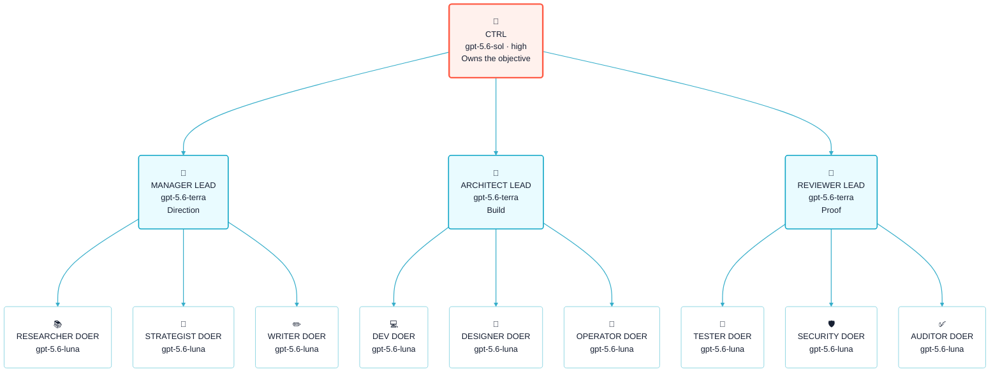

<p align="center">
  <a href="https://flowwweb.com/swarm">
    
  </a>
</p>

<p align="center">
  <strong>One objective. Clear ownership. A coordinated Codex team.</strong>
</p>

<p align="center">
  <a href="https://github.com/flowwweb/swarm/blob/main/LICENSE"></a>
  <a href="https://flowwweb.com/swarm"></a>
  <a href="https://github.com/flowwweb/swarm"></a>
</p>

SWARM is an open-source Codex plugin for work that benefits from more than one agent. You direct a single CTRL task. CTRL divides the objective into clear lanes, LEADs own the outcome of each lane, and DOERs complete focused work inside them.

The hierarchy keeps parallel work understandable: one place to steer, one owner for every lane, and one integrated result to review.

[Explore SWARM](https://flowwweb.com/swarm) · [View the repository](https://github.com/flowwweb/swarm)

## How the hierarchy works

This example shows a full three-lane swarm. The professions change with the objective; the hierarchy does not.



The icons match SWARM task titles. Every visible task says both what expertise it brings and whether it is a LEAD or DOER; bare structural titles are rejected before creation.

- **CTRL** is the sole control point. It understands your objective, chooses the lanes, resolves cross-lane decisions, and returns the combined result.
- **LEADs** own distinct outcomes. They coordinate their DOERs, integrate the work, and bring back evidence instead of activity reports.
- **DOERs** complete bounded assignments. They can be developers, researchers, designers, testers, writers, or any other specialist the objective needs.

The model labels are role defaults for this example, not proof of execution. The
Codex host owns model, service-tier, and reasoning selection; SWARM reports the
host-observed values when that metadata is available.

## Small work stays small

SWARM does not turn every request into a fleet.

- A small or medium assignment on one surface can stay inside the current task and use bounded subagents.
- A large, parallel, resumable, isolated, or independently accepted outcome earns a visible task lane.
- A task lane can use its own subagents when that reduces overhead without hiding ownership.
- Small `CTRL_DIRECT` work remains available for one low-risk atomic general outcome; design, mockup, and image-generation work goes to a DESIGNER lane even when it is small.
- Usage limits constrain the available route; they do not decide the structure when normal capacity is available.

This keeps quick work quick while giving larger objectives durable lanes that can progress in parallel.

## Intake and domain graphs

At the start of every new task, CTRL captures two answers: the goal and the
most efficient safe way to reach it. Durable goal persistence is on by default
and can be disabled with `goals.use_goals = false`; disabling persistence does
not disable intake, graph selection, ownership, or proof.

CTRL then selects the most efficient and smallest graph that can complete the
objective durably, reliably, and confidently. Game projects use
the registered game-studio flow: design, engineering, art, and audio can run
as independent production lanes, followed by integrated playtest/QA and
release gates. The graph is an ownership and dependency contract, not a flat
agent roster. See [graph engineering](skills/swarm/references/graph-engineering.md)
for the invariants and profile.

Every agent may request an approved role skill with an exact source/version or
digest and task-local scope by default. The host owns installation and audit;
skills improve execution but never grant authority or turn CTRL into a producer.

## What you get back

- **A quiet control stream.** CTRL surfaces decisions, blockers, proof, and completed outcomes—not routine agent chatter.
- **Visible ownership.** Every lane has a named outcome, an accountable LEAD, and bounded work beneath it.
- **Focused proof.** SWARM selects the smallest sufficient checks for the changed surface and expands them when risk or uncertainty requires it.
- **Independent acceptance.** Work is not complete because an agent says it is; the required evidence and review must close.
- **Human authority.** A swarm has one CTRL. Creating or replacing another CTRL requires an explicit user request.

## Install in Codex

Add the Flowwweb marketplace:

```text
codex plugin marketplace add flowwweb/swarm --ref main
```

Run `/plugins`, open **Flowwweb**, install **SWARM**, and start a new Codex task so the plugin loads into fresh context.

Then ask Codex to use it:

```text
Use SWARM to ship the next release of this project.
```

That task becomes `🐙CTRL - <objective>`: the one place where you direct the work and review what the swarm returns.

To update an existing installation:

```text
codex plugin marketplace upgrade flowwweb
codex plugin add swarm@flowwweb
```

Start a new task after reinstalling.

## Configure SWARM

SWARM uses one global TOML file: `~/.agents/swarm/config.toml`. Initialize it
from the maintained template, edit only the settings you need, then validate
the result:

```text
python skills/swarm/scripts/swarm_config.py init
python skills/swarm/scripts/swarm_config.py validate
python skills/swarm/scripts/swarm_config.py show
```

The common controls are deliberately small:

```toml
[execution]
fast_mode = true       # the only Fast-mode switch

[automation]
mode = "standard"      # or "manual"

[console]
open_on_start = false
```

Changes apply at the next safe scheduling boundary; start a new task after a
plugin update. Fast mode requests the host's faster service tier but is reported
active only when host response metadata confirms it. Config never overrides an
explicit user choice or grants task, Git, release, provider, or user-state
authority. See the [configuration reference](skills/swarm/references/config.md)
for every supported key and its claim limits.

## Local console

SWARM includes an optional loopback-only console for seeing the live hierarchy, task state, requested and observed models, reasoning levels, lightweight logs, evidence, and blockers.

```text
python skills/swarm/scripts/swarm_console.py --start
```

Python 3.11 or newer is required. Docker is optional:

```text
python console/docker.py up
```

The console shows what SWARM knows; it does not invent host activity or passing proof. Settings writes are validated and loopback-only in both native and Docker modes. Docker keeps Codex task metadata read-only, writes only the bounded SWARM proof directory, and stores console history in its named volume.

## Codex-native scope

SWARM is a Codex plugin and workflow: Codex is the only agent host whose task,
tool, model, and execution behavior this repository describes or routes. The
`plugins/swarm` tree is the generated Codex marketplace mirror of the canonical
`skills/swarm` source. SWARM does not ship, install, or claim compatibility with
Claude Code, Anthropic, Gemini, Copilot, Cursor, OpenCode, or another agent host.

The word `provider` may still appear in proof contracts for a real external
service boundary such as authentication, payments, deployment, or browser
evidence. That proof category is not a model-host adapter and does not create a
second execution authority. Host installation, activation, task behavior, and
served-tier claims require their own direct receipts.

## Reference

- [Hierarchy and role contracts](skills/swarm/references/hierarchy.md)
- [Configuration and model profiles](skills/swarm/references/config.md)
- [Review and acceptance](skills/swarm/references/review-contract.md)
- [Console guide](console/README.md)
- [Contributing](CONTRIBUTING.md)
- [Security](SECURITY.md)
- [MIT License](LICENSE)
