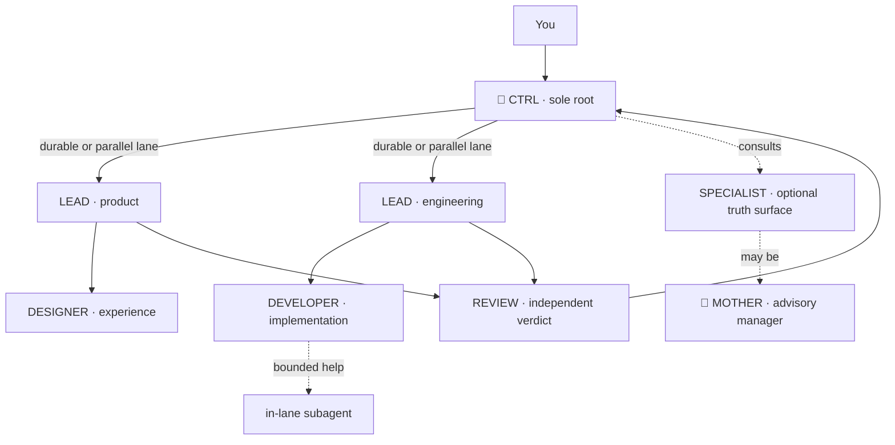
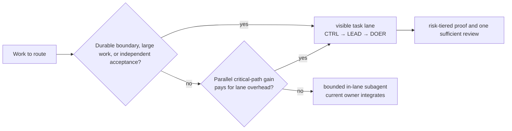
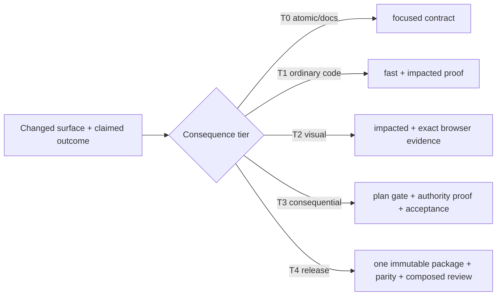
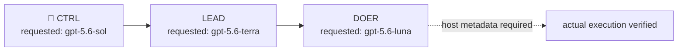
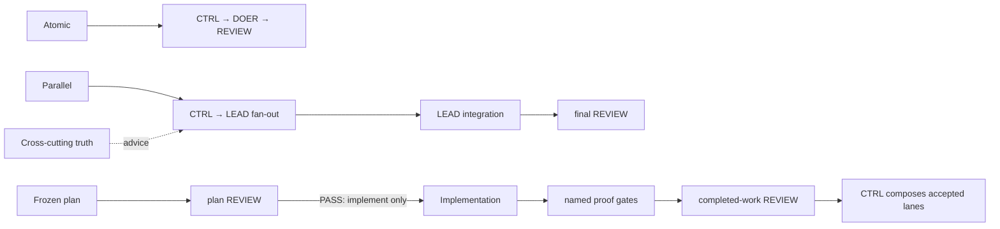
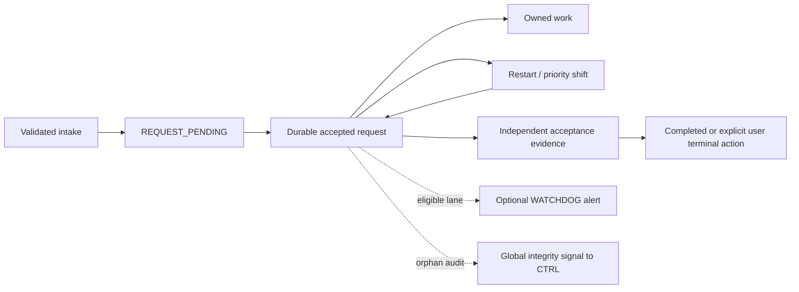
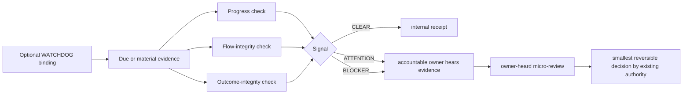

<p align="center">
  <a href="https://flowwweb.com/swarm">
    
  </a>
</p>

<p align="center">
  <strong>Structured Workflows for Autonomous Role Management</strong>
</p>

<p align="center">
  <a href="https://github.com/flowwweb/swarm/blob/main/LICENSE"></a>
  <a href="https://flowwweb.com/swarm"></a>
  <a href="https://github.com/flowwweb/swarm"></a>
</p>

SWARM is an open-source workflow for Codex.

Install it as a Codex plugin and run a coordinated team of AI agents from one CTRL task. CTRL routes work to clear leads, leads delegate focused lanes, and independent review checks the combined result. The hierarchy gives parallel agents direction, shared state, and a clean route back to you—without turning every project into a polling loop.

[Explore SWARM](https://flowwweb.com/swarm) · [View the repository](https://github.com/flowwweb/swarm)

## One command point. A whole team.



SWARM chooses the shallowest structure that can reliably finish the objective. Small work stays small. Parallel work gets explicit owners. CTRL remains the sole root and final composed authority. Persistent specialists protect one cross-cutting truth without becoming another management layer. MOTHER is available only as an optional advisory manager-specialist; it never schedules, leases, reviews, or accepts.

A CTRL cannot create, fork, promote, replace, rename, recover-as-new, or link
another CTRL unless you explicitly request that exact operation. SWARM consumes
one authorization bound to the source CTRL, target identity, objective, and
scope; a mismatch or replay creates no host intent. Researchers, Architects,
LEADs, DOERs, and REVIEW remain subordinate roles and need no CTRL-creation
authorization.

## Pick the lane that earns its overhead

Use a bounded in-lane subagent for small-to-medium work on one surface when it
does not need durable ownership, isolated mutation, a separate handoff, or
independent acceptance. It keeps the current owner accountable and avoids
turning quick work into a task tree.

Create a visible task lane when work is large, resumable, isolated in a
worktree or artifact, independently reviewed or accepted, or needs a durable
handoff. For independent slices, create the lane when its accepted
critical-path saving repays task startup, coordination, integration, and review
overhead. A qualifying durable boundary always wins; a subagent cannot stand in
for it.



Host capacity and usage limits are constraints, not the normal routing rule. If
a required lane cannot be created, SWARM records the exact host limitation and
may use a degraded, non-authoritative checkpoint under the current owner; the
durable ownership, handoff, review, and acceptance claims remain unverified.

## Prove only what changed and what matters

SWARM compiles one deterministic proof plan from the changed surfaces, claims,
authority boundaries, dependency reach, matching incidents, runtime signals,
and repository capabilities. Unknown impact broadens proof; known impact keeps
it focused.



Stable exact-input gate receipts can be re-observed and adopted, but never
transfer acceptance authority. A correction reruns the failed gate and its
dependents, not unrelated accepted work. Timeouts remain `TIMEOUT`; only one
typed transient retry is allowed. Final acceptance is always fresh and
independent at the tier selected by the plan.

## Model requests are not execution proof

The default request pattern for a full hierarchy is **CTRL → gpt-5.6-sol**,
**LEAD → gpt-5.6-terra**, and **DOER → gpt-5.6-luna**. These are requested role
preferences, not a claim that the host executed those models. Explicit user
model, provider, service-tier, and reasoning choices take precedence. Record a
host model receipt before claiming actual execution.





The runtime workflow graph is a deterministic, read-only view derived from existing task, owner, dependency, artifact, gate, and review facts. It is not a graph service, scheduler, database, or second authority.

Accepted requests add one small private continuity record—not another planner. It retains the accountable owner, accepting route, safe derived outcome identity, next due event, and last published feed cursor across an explicit restart. A fresh runtime uses that cursor only as an ordering floor for a newly validated event; it does not replay old feed authority. New requests can move in priority, but they cannot erase an open request. The record does not grant task, review, gate, or release authority.





The result is a swarm you can steer from one place:

- **One visible control stream.** Decisions, blockers, evidence, and acceptance come back to CTRL; routine chatter stays quiet.
- **Parallel work without duplicate ownership.** Every lane has a bounded artifact, mutable surface, and accepting route.
- **Hierarchy that earns its place.** Roles appear for real dependencies and collapse when they stop helping.
- **Coherent results.** Leads integrate their lanes and REVIEW verifies the composed outcome before it is accepted.
- **Alerts without management theatre.** An optional WATCHDOG binds only to the accountable LEAD, samples progress, flow, and outcome integrity at a due event or material signal, and leaves every decision with existing authority.

## Install

Add the Flowwweb marketplace to Codex:

```text
codex plugin marketplace add flowwweb/swarm --ref main
```

Run `/plugins`, open the **Flowwweb** marketplace, and install **SWARM**. Start a new Codex task so the plugin loads into fresh context.

Then ask Codex to use it:

```text
Use SWARM to ship the next release of this project.
```

That task becomes `🐙CTRL - <objective>`: the single place where you direct the objective and review what the swarm returns.

## Other hosts

The canonical doctrine and resources live in [`skills/swarm`](skills/swarm). In this repository, Codex installs the generated `plugins/swarm` product mirror; one shared package policy owns that mirror and the release ZIP, and CI rejects drift. Other hosts consume the canonical source directly and do not introduce host-specific agents or hooks.

| Host | Repository surface | Install or discovery route | Proof supplied here |
| --- | --- | --- | --- |
| Claude Code | `.claude-plugin/plugin.json` | `claude plugin marketplace add flowwweb/swarm`, then `claude plugin install swarm@flowwweb` | Manifest and marketplace structure only |
| Gemini CLI | `gemini-extension.json` and `skills/swarm` | `gemini extensions install https://github.com/flowwweb/swarm.git` | Manifest and skill-layout structure only |
| GitHub Copilot, Cursor, OpenCode | `.agents/skills/swarm` | Run the copy command below in the target project | Copy and file-hash parity when the command succeeds |

For the shared Agent Skills location, copy the canonical skill into another project without adding a tracked mirror to this repository:

```text
python <swarm-repository>/skills/swarm/scripts/verify_plugin_install.py --install-agent-skill <target-project-root>
```

The command only writes `<target-project-root>/.agents/skills/swarm`, refuses an existing destination, rejects links and junctions, and verifies the copied files against the canonical source. It refuses this SWARM repository itself so the copy cannot become a second tracked authority.

These checks do not prove a host installation, activation, prompt loading, agent behavior, marketplace availability, or an external release. Run each host's install command in its own environment before making those claims.

## Update

```text
codex plugin marketplace upgrade flowwweb
codex plugin add swarm@flowwweb
```

Start a new Codex task after reinstalling so it loads the updated plugin.

## Console

SWARM includes an optional loopback-only console for inspecting hierarchy and validated local settings. Python 3.11 or newer is required; the console uses only the Python standard library.

An explicit SWARM start opens the portal in your default browser by default. The launcher reuses the existing local server and any open portal tab. Change **Open portal on start** in Settings to disable this behavior.

```text
python skills/swarm/scripts/swarm_console.py --start
```

Docker is optional:

```text
python console/docker.py up
```

The console is an observability surface, not the authority for task state.

## Develop

```text
python scripts/sync_plugin_mirror.py --write
python scripts/sync_plugin_mirror.py --check
python scripts/run_test_tier.py fast
python scripts/run_test_tier.py platform
python -m unittest skills.swarm.tests.test_release_package
python -m unittest discover -s console/tests -p "test_*.py"
cd console && npm ci && npx playwright install chromium && npm run test:ui
```

The fast tier excludes package integration; run the package tier only when its
surface is affected or before release. CI builds one immutable ZIP, verifies
those same bytes on each supported operating system, and publishes those same
bytes without rebuilding. The pinned browser lane runs only when console
surfaces change. See [CONTRIBUTING.md](CONTRIBUTING.md), [SECURITY.md](SECURITY.md), and the [MIT License](LICENSE).

## Release verification

Build from a clean, committed checkout. The archive is reproducible and assembled
from one captured Git commit/tree snapshot: it records the plugin version, commit,
tree, and a SHA-256 manifest for every shipped product file. Write the archive
outside the repository so the clean-source check remains meaningful.

```text
python scripts/sync_plugin_mirror.py --check
python scripts/build_package.py --output ../swarm.zip --verify-repeat
python skills/swarm/scripts/verify_plugin_install.py <installed-plugin-root> --package ../swarm.zip
python skills/swarm/scripts/verify_plugin_install.py <installed-plugin-root> --source .
```

The builder writes `swarm.zip.sha256` beside the archive; package verification
requires that exact sidecar. The verifier checks the whole shipped surface—plugin
manifests, production skill resources, console and Docker files, and public documentation/security
files. Development-only tests, eval fixtures, CI workflows, and internal friction notes remain in source but are not in a release archive. Installed parity ignores only host Git metadata, generated `__pycache__`
contents, and generated package metadata; logs, loose bytecode, state, build output,
and dependency directories fail verification.
