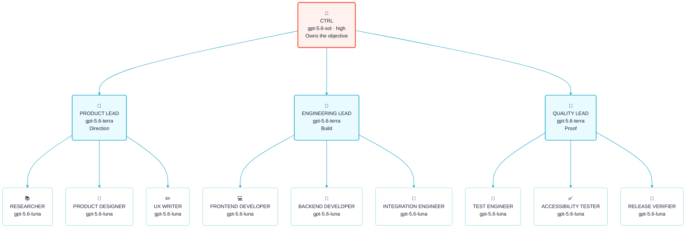

<p align="center">
  <a href="https://flowwweb.com/swarm">
    
  </a>
</p>

<p align="center">
  <strong>One objective. Clear ownership. A coordinated Codex team.</strong>
</p>

<p align="center">
  <a href="https://github.com/flowwweb/swarm/blob/main/LICENSE"></a>
  <a href="https://flowwweb.com/swarm"></a>
  <a href="https://github.com/flowwweb/swarm"></a>
</p>

SWARM is an open-source Codex plugin for work that benefits from more than one agent. You direct a single CTRL task. CTRL divides the objective into clear lanes, LEADs own the outcome of each lane, and DOERs complete focused work inside them.

The hierarchy keeps parallel work understandable: one place to steer, one owner for every lane, and one integrated result to review.

[Explore SWARM](https://flowwweb.com/swarm) · [View the repository](https://github.com/flowwweb/swarm)

## How the hierarchy works

This example shows a full three-lane swarm. The professions change with the objective; the hierarchy does not.



The icons match SWARM task titles: one role icon makes the CTRL, LEAD, and profession of each task recognizable before you read the full name.

- **CTRL** is the sole control point. It understands your objective, chooses the lanes, resolves cross-lane decisions, and returns the combined result.
- **LEADs** own distinct outcomes. They coordinate their DOERs, integrate the work, and bring back evidence instead of activity reports.
- **DOERs** complete bounded assignments. They can be developers, researchers, designers, testers, writers, or any other specialist the objective needs.

The model labels are role defaults for this example, not proof of execution. Your explicit model, provider, service-tier, and reasoning choices win. SWARM reports the host-observed model and reasoning level when that metadata is available.

## Small work stays small

SWARM does not turn every request into a fleet.

- A small or medium assignment on one surface can stay inside the current task and use bounded subagents.
- A large, parallel, resumable, isolated, or independently accepted outcome earns a visible task lane.
- A task lane can use its own subagents when that reduces overhead without hiding ownership.
- Usage limits constrain the available route; they do not decide the structure when normal capacity is available.

This keeps quick work quick while giving larger objectives durable lanes that can progress in parallel.

> **ChatGPT offload.** Turn on **Save Codex usage with ChatGPT**, then choose **Light**, **Balanced**, **High**, or **Max**: Light is selective and Max routes every task the connected provider can handle. Enable **Allow ChatGPT to work** and register an external CodexPro, CCCC, or compatible MCP bridge to let ChatGPT read, edit, test, run approved commands, or create provider-owned assets inside its exact local or cloud workspace scope. SWARM keeps verification and acceptance local; count savings only from provider receipts.

## What you get back

- **A quiet control stream.** CTRL surfaces decisions, blockers, proof, and completed outcomes—not routine agent chatter.
- **Visible ownership.** Every lane has a named outcome, an accountable LEAD, and bounded work beneath it.
- **Focused proof.** SWARM selects the smallest sufficient checks for the changed surface and expands them when risk or uncertainty requires it.
- **Independent acceptance.** Work is not complete because an agent says it is; the required evidence and review must close.
- **Human authority.** A swarm has one CTRL. Creating or replacing another CTRL requires an explicit user request.

## Install in Codex

Add the Flowwweb marketplace:

```text
codex plugin marketplace add flowwweb/swarm --ref main
```

Run `/plugins`, open **Flowwweb**, install **SWARM**, and start a new Codex task so the plugin loads into fresh context.

Then ask Codex to use it:

```text
Use SWARM to ship the next release of this project.
```

That task becomes `🐙CTRL - <objective>`: the one place where you direct the work and review what the swarm returns.

To update an existing installation:

```text
codex plugin marketplace upgrade flowwweb
codex plugin add swarm@flowwweb
```

Start a new task after reinstalling.

## Local console

SWARM includes an optional loopback-only console for seeing the live hierarchy, task state, requested and observed models, reasoning levels, lightweight logs, evidence, and blockers.

```text
python skills/swarm/scripts/swarm_console.py --start
```

Python 3.11 or newer is required. Docker is optional:

```text
python console/docker.py up
```

The console shows what SWARM knows; it does not invent host activity or passing proof. Native loopback mode permits validated settings writes. Docker mode is read-only.

### Windows or macOS host

The SWARM runtime and console use Python 3.11+ and the standard library, so the same plugin package runs on Windows and macOS. Use `python` on Windows and `python3` on macOS:

```text
# Windows
python skills/swarm/scripts/swarm_console.py --start

# macOS
python3 skills/swarm/scripts/swarm_console.py --start
```

The Codex plugin and Agent Skills copy are portable too. From a checked-out SWARM repository, install the shared skill into a project with:

```text
python3 skills/swarm/scripts/verify_plugin_install.py --install-agent-skill <target-project-root>
```

Use `python` instead of `python3` on Windows. The verifier checks the complete shipped skill surface; it does not require a host-specific installer.

### iPhone or iPad client

The host process stays on Windows or macOS. To use the console from an iPhone or iPad on the same trusted LAN, start the explicit read-only network bind on the host:

```text
# Windows
python skills/swarm/scripts/swarm_console.py --host 0.0.0.0

# macOS
python3 skills/swarm/scripts/swarm_console.py --host 0.0.0.0
```

Find the host’s LAN IPv4 address (`ipconfig` on Windows, `ifconfig` on macOS), then open `http://<host-lan-ip>:4788` in Safari. Use Safari’s **Add to Home Screen** to install SWARM as a standalone client. Remote clients receive the console and live read-only data; they cannot acquire the local token or write configuration. Keep this mode on a trusted network and stop it with `Ctrl+C` when finished. Loopback mode remains the default.

## Other hosts

The canonical skill lives in [`skills/swarm`](skills/swarm). Codex installs the generated [`plugins/swarm`](plugins/swarm) mirror; CI rejects drift between them.

| Host | Install or discovery route | Proof supplied by this repository |
| --- | --- | --- |
| Claude Code | `claude plugin marketplace add flowwweb/swarm`, then `claude plugin install swarm@flowwweb` | Manifest and marketplace structure only |
| Gemini CLI | `gemini extensions install https://github.com/flowwweb/swarm.git` | Manifest and skill-layout structure only |
| GitHub Copilot, Cursor, OpenCode | Copy `skills/swarm` to the project's `.agents/skills/swarm` | Copy and file-hash parity when the command succeeds |

Use the verified copy command for the shared Agent Skills location:

```text
python <swarm-repository>/skills/swarm/scripts/verify_plugin_install.py --install-agent-skill <target-project-root>
```

These checks do not prove a host installation, activation, prompt loading, agent behavior, marketplace availability, or an external release. Verify each host in its own environment before making those claims.

## Reference

- [Hierarchy and role contracts](skills/swarm/references/hierarchy.md)
- [Configuration and model profiles](skills/swarm/references/config.md)
- [Review and acceptance](skills/swarm/references/review-contract.md)
- [Console guide](console/README.md)
- [Contributing](CONTRIBUTING.md)
- [Security](SECURITY.md)
- [MIT License](LICENSE)
