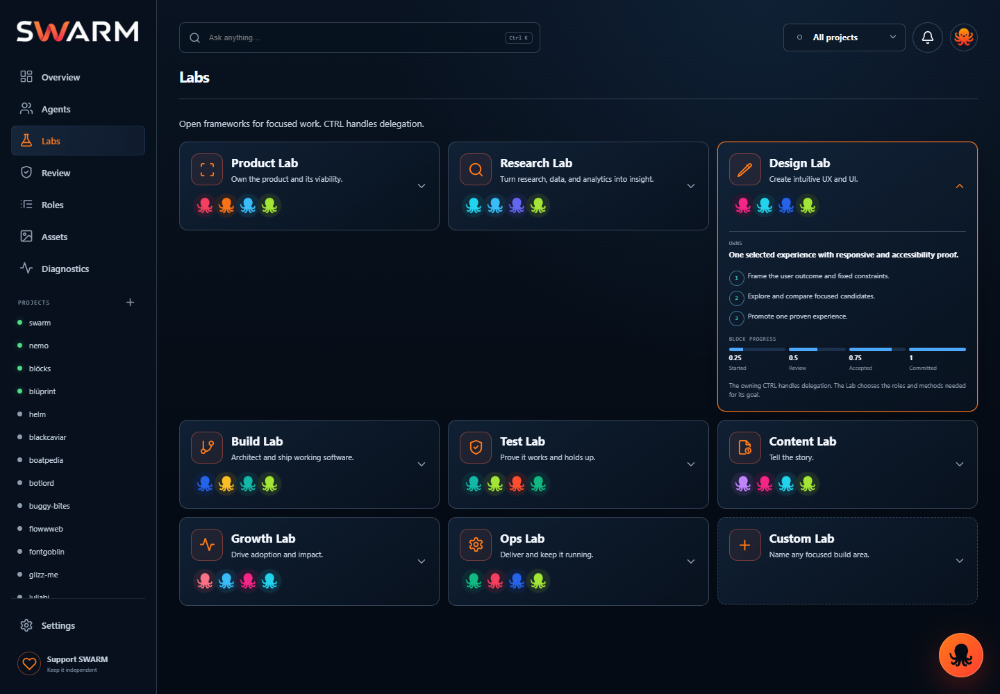
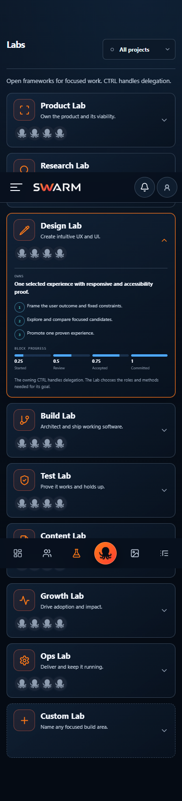

# SWARM Design Lab progress

## Current result

The Labs slice is implemented in the live HQ. It uses the established SWARM shell, eight broad Lab manifests, compact role avatars, one-at-a-time disclosure, and the existing quarter-point block model. CTRL remains the only delegation authority.

| Area | Status | Evidence |
| --- | --- | --- |
| Labs catalog | Implemented | Eight built-in Labs plus Custom Lab render from the repo-owned catalog. |
| Lab details | Implemented | One selected Lab exposes its outcome, thin guidance, and `.25 / .5 / .75 / 1` block states. |
| Role avatars | Implemented | Compact, circular, role-colored SWARM mascots are reused from the shared avatar primitive. |
| Desktop layout | Implemented | Three-column catalog with a single expanded Lab. |
| Mobile layout | Implemented | One-column cards, sticky app bar, and icon-only footer navigation. |
| Lab delegation controls | Removed by design | Labs are open task frameworks. CTRL handles delegation. |
| Separate Lab runtime | Skipped by design | Labs reuse normal SWARM tasks, blocks, proof, review, and milestones. |

## Implemented desktop

Fresh live capture from `http://127.0.0.1:4788/#labs`, with Design Lab selected.

## Implemented mobile

Fresh responsive capture of the same implementation.

## Broader HQ Design Lab status

| Screen | Current status |
| --- | --- |
| Labs | Implemented and visually verified on desktop and mobile. |
| Settings | Simplified essentials layout is implemented, including visual theme choices. |
| Overview | Simplified shell and live project/task observation are implemented. Final hierarchy and usage authority still depend on accepted project receipts. |
| Agents | Live host tasks render, but the current screen remains denser than the approved minimal direction. |
| Roles | Shared avatar primitives are implemented. Detail-panel simplification still needs a fresh live visual acceptance pass. |
| Review | Functional coverage exists; the approved quick-action visual still needs fresh live proof. |
| Assets | An approved mockup exists. Current live parity is not proven by a fresh screenshot. |
| Diagnostics | An approved mockup exists. Current live parity is not proven by a fresh screenshot. |
| Notifications | Updated behavior exists in the UI test surface. Current live visual acceptance is not yet proven. |
| Onboarding | Current assets and responsive contracts exist. Slide-by-slide live parity is not yet proven. |

## Verification

- Lab catalog and role-binding tests: **PASS**, 6 tests.
- Plugin mirror: source and packaged plugin are synchronized at the current commit.
- Full HQ browser suite: **FAIL**, timed out waiting for the message composer to enter `pending` after Send. This is a real open regression and prevents a full-screen green claim.

The screenshots above are implementation evidence, not generated mockups. Older before images are omitted because the implemented result is available directly.
