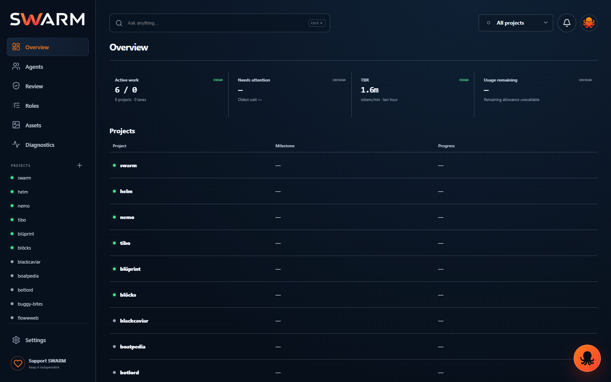
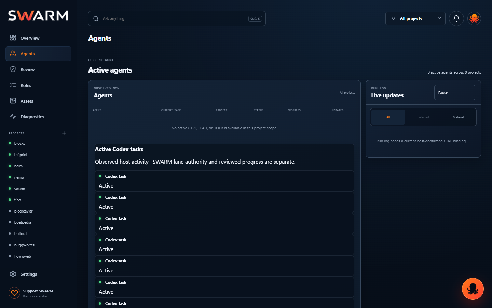
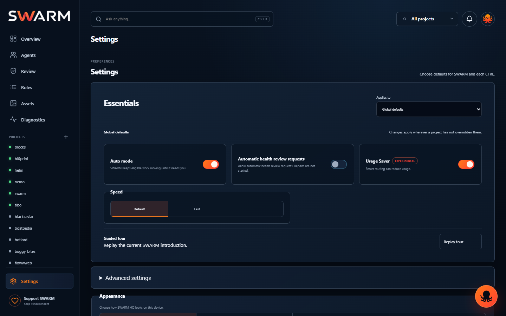

# SWARM HQ current UI review

Captured from the canonical SWARM console checkout on 2026-09-12. Desktop captures use a 1440×900 viewport; mobile captures use 390×844. The screenshots are live browser renders, not mockups.

The capture run exercised the local console, onboarding, all seven top-level routes, one real project route, the chat panel, the usage detail, and two mobile routes. The canonical server was then restored on `http://127.0.0.1:4788/`.

## Route coverage

| Surface | Rendered state | Review result |
| --- | --- | --- |
| Overview | 5 projects listed; active host work visible; three metrics remain unavailable | Layout is clean; data binding is incomplete |
| Agents | Empty accepted roster with observed host tasks below | Honest separation, but no accepted agent hierarchy |
| Roles | Three-column mascot library with closed detail accordions | Desktop is scannable; Architect asset blocker is visible |
| Review | Proof list with actions | Dense but usable; project scope prompt is clear |
| Assets | Empty project asset state | Empty state is clear |
| Diagnostics | Health signals, checks, and trend | Needs attention state is actionable |
| Settings | Essentials, Usage Saver, tour, advanced settings, appearance | Structure is clear; provider relay still needs proof |
| Project detail | Host work table with observed tasks | Real host activity renders; project ledger is still loading/unavailable |
| Chat panel | Recipient selector, conversation body, composer, send control | Chat shape is correct; no observed recipients/conversations in this scope |
| Usage detail | Remaining allowance, reset, projected exhaustion, range controls | Modal boundary is clear; account allowance is unavailable |

## Overview

The overview now uses the intended four-stat header and a compact project table. The current feed confirms five projects and zero accepted lanes, while Needs attention, TBR, and Usage remaining correctly stay `UNKNOWN` because the backing readings are not available.

## Agents

The screen does not fabricate agents. It reports that no accepted CTRL, LEAD, or DOER is available and shows observed Codex host tasks separately. This is the correct trust boundary, but it also explains why the hierarchy is not populated yet.

## Roles

The role grid is compact and the detail panel hides long text behind accordions. The admitted Architect avatar is still the orange asset called out by the onboarding blocker; that is an asset-admission issue, not a CSS recolor.

The mobile role cards now keep the 44px circular mascot and the role name in separate grid columns. The earlier overlap was caused by the later compact rules overriding the existing mobile layout; the shared CSS seam now restores the mobile columns.

## Review

Proof items and actions are visible in one review list. The screen is populated with pending evidence records from the local store.

## Assets

The empty project asset state is explicit and does not present placeholder cards as real assets.

## Diagnostics

Diagnostics shows six open health signals and keeps unknown checks visibly distinct from passing checks. The two actionable signals expose a “Review with CTRL” action.

## Settings

The settings surface is reduced to essentials first, with Usage Saver enabled in the captured config and advanced settings collapsed. The screenshot proves the control is rendered; it does not prove an external ChatGPT relay is operating.

## Project detail

Project detail renders observed host work rows and their host status. The project ledger header is still loading for this project, so progress, ETA, and next gate remain unavailable instead of being guessed.

## Chat and usage details

The panel has a header, recipient selector, conversation body, bottom composer, and send control. The current scope reports no observed conversations or recipients, so sending remains unavailable for this capture.

Usage is a separate modal with 1d/1w/1m ranges, a settings control, and clear remaining/reset/exhaustion labels. The account allowance itself is still unavailable.

## Onboarding

The five slides use the same dark SWARM shell, typography, orange action, and progress treatment. Slide 3 intentionally exposes the canonical Architect asset blocker instead of silently substituting a different mascot.

## Mobile overview

The mobile shell keeps the compact header, project switcher, four metrics, project list, and bottom navigation. The same unavailable data states are preserved on mobile.

## Findings

1. **P1 — Accepted hierarchy is still missing.** The live overview reports zero accepted lanes and the Agents view reports no accepted CTRL/LEAD/DOER. Observed host tasks are rendered separately, so the UI is truthful but the required canonical hierarchy is not yet connected to live project records.
2. **P1 — Usage Saver relay is not externally proven.** The setting is enabled locally, but the relay telemetry is historical and the native connector still requires reauthentication. No current ChatGPT relay write/read-back receipt exists.
3. **P1 — Usage and TBR readings are unavailable.** The cards and modal render the correct unknown state, but no live allowance, burn rate, or projected exhaustion can be claimed.
4. **P2 — Project ledgers are sparse.** The project list and host work render, but current milestone, progress, ETA, and next gate are absent for the captured project.
5. **P2 — Architect role asset admission remains blocked.** The UI correctly preserves the canonical orange asset and calls out the missing approved white Architect asset.

## Changes made during this review

- Removed the duplicate role-library CSS block and restored the existing compact two-column rules after the final role polish block.
- Added the exact SHA-256 CSP allowance for the inline theme bootstrap to both server mirrors. A fresh capture reported zero browser console errors after this change.
- Replaced the stale 4788 listener with the canonical checkout server. Its health endpoint returned build `9999307989b10723`, and its response CSP includes the theme script hash.

## Proof

- A temporary Playwright capture run from the canonical checkout: 17 screenshots, `consoleErrors: []`; the capture helper was removed after the evidence was written.
- `python -m unittest skills/swarm/tests/test_swarm_chatgpt_setup.py skills/swarm/tests/test_execution_adapters.py skills/swarm/tests/test_swarm_mcp.py -q`: 53 tests passed.
- `node --test console/tests/test_console_ui.mjs`: passed; one post-fix run, 1 test, 0 failures.
- `node --check console/static/app.js`: passed.
- `node --check plugins/swarm/console/static/app.js`: passed.
- `node --check console/tests/test_console_ui.mjs`: passed.
- `git diff --check`: passed.
- `GET http://127.0.0.1:4788/healthz`: passed; service `swarm-console`, build `9999307989b10723`.
- `GET http://127.0.0.1:4788/`: passed; CSP includes `sha256-x8FxVWabrociDs2IzqzDiBN1tPk6YlRe6Hgcbr191e0=`.

The screenshots prove rendered local behavior and current data states. They do not prove external ChatGPT authentication, provider relay execution, or accepted hierarchy data until those backing contracts produce fresh receipts.
