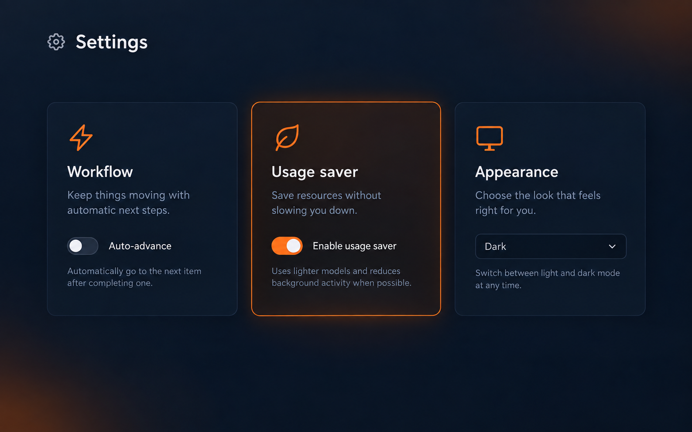
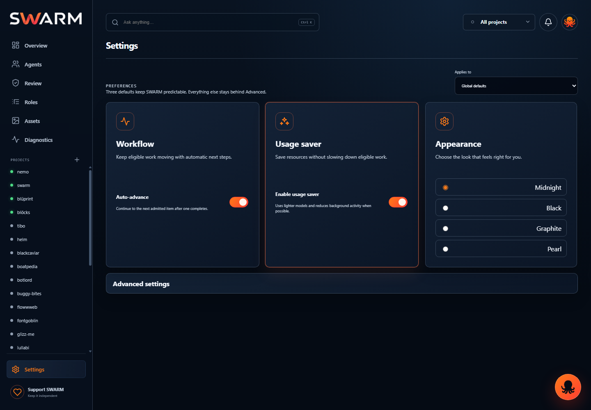
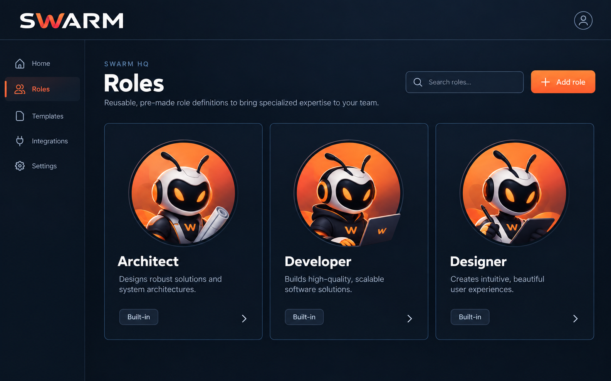
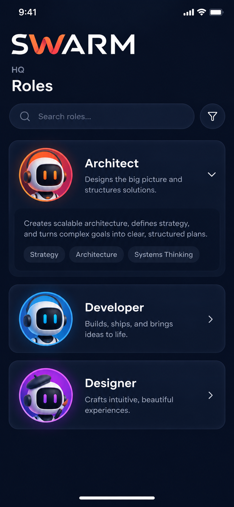
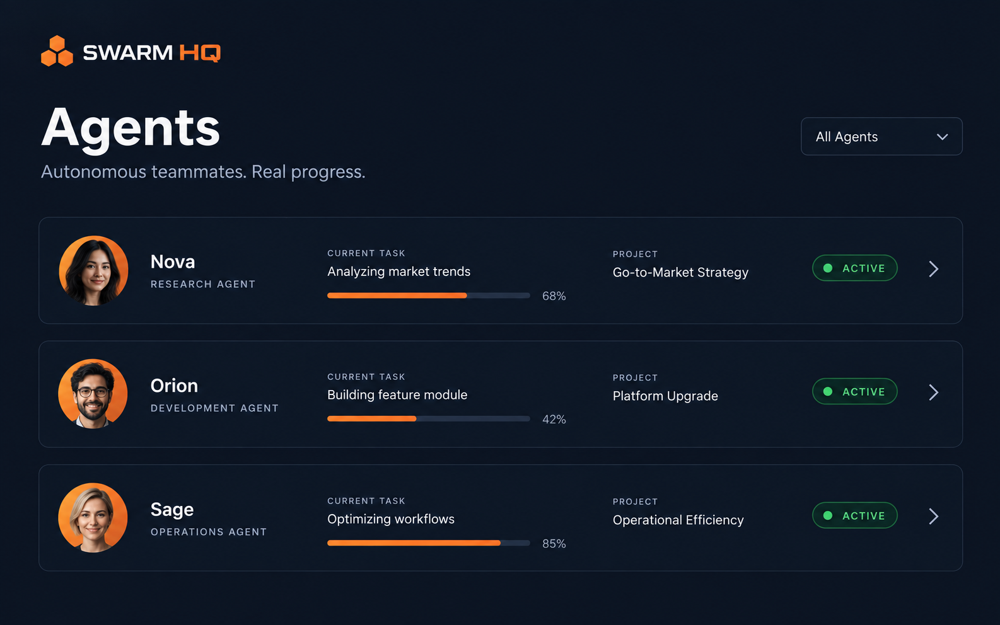
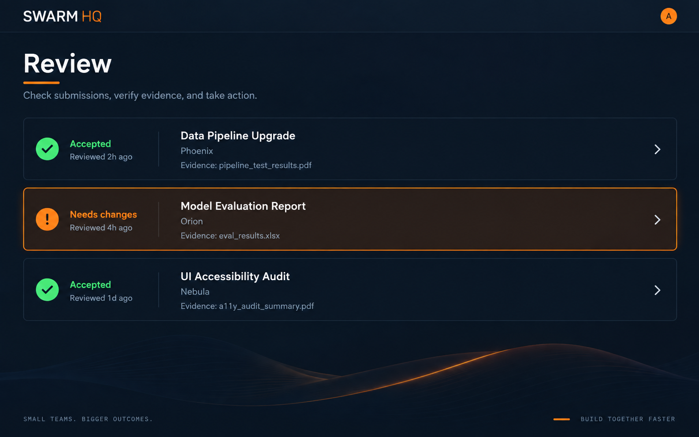
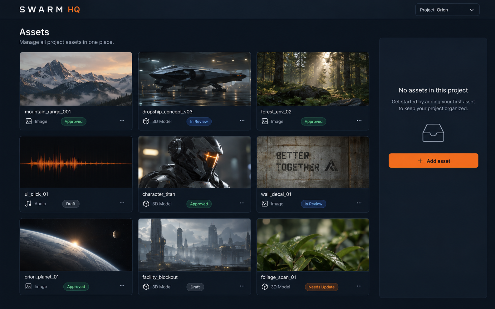
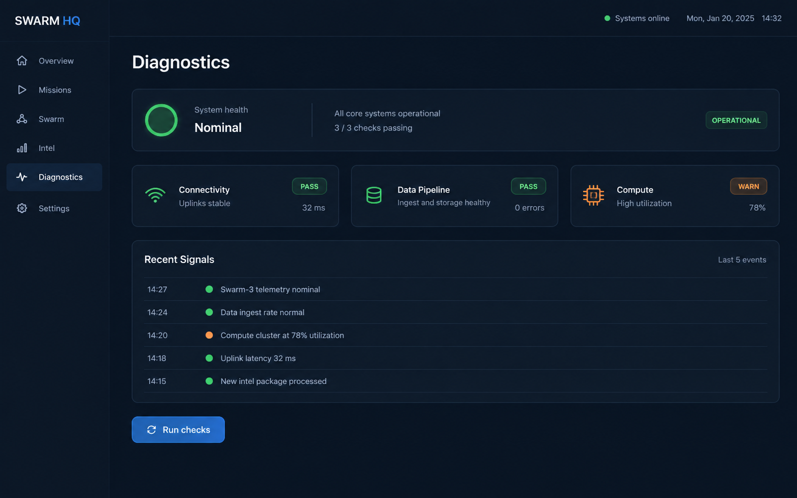
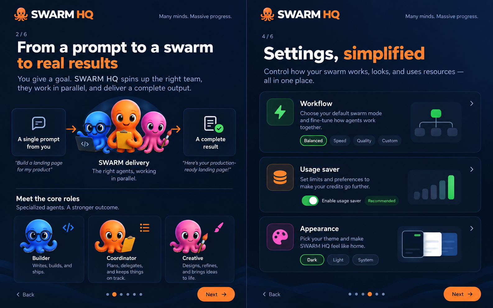

# SWARM HQ visual pass — 2026-09-13

This pass applies the approved compact HQ treatment to Settings and reduces repeated page titles. The attached mockups are references, not production data: live screens continue to render only observed project/task facts and accepted receipts.

## Settings — approved reference and implementation

Implemented in `console/static/app.js` and `console/static/styles.css`: three essential cards (Workflow, Usage saver, Appearance), with scope and advanced controls behind one drawer. The old duplicate static title was removed from `console/static/index.html` so the page has one Settings heading.

This live capture is from `http://127.0.0.1:4788/#settings` after the onboarding dialog was dismissed in a clean browser profile. It shows the shared SWARM chrome, one Settings title, populated icons, three cards, and the collapsed advanced drawer.

## Roles — reusable library

Roles remain a premade role library. They do not own tasks, progress, or completion. Those facts belong to Agents and the Swarm hierarchy. Role detail content remains collapsed until opened.

## Agents, Review, Assets, Diagnostics, onboarding

The current implementation keeps these screens functional while the compact pass removes redundant headings and exposes only supported actions. Review now has quick actions to open the task, copy the proof id, and open visual evidence when it exists. Assets and diagnostics keep explicit empty/unavailable states instead of presenting placeholder data.

## Data proof

`GET /api/overview?project_id=all` exposes project `task_count` and `active_now_count`; the overview table displays those observed facts when no accepted percentage receipt exists and explains why completion remains unavailable. It no longer renders a bare dash for a project that has real task activity.
